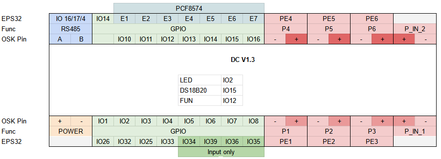
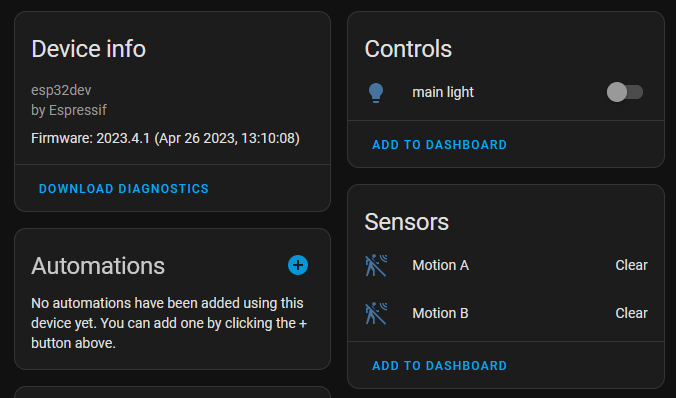

# Integration using ESPHome

This is the simplest way to integrate OSK into Home Assistant, especially if you are already familiar with ESPHome.

The first step is to flash the OSK module with ESPHome firmware. Depending on the setup, it can be done [from Home Assistant](https://esphome.io/guides/getting_started_hassio.html) or [using the command line](https://esphome.io/guides/getting_started_command_line.html) (use board esp32dev).

The DC module has 16 IO pins (9 native ESP32 pins, plus 7 additional pins via PCF8574 expander) and 6 dimming channels driven by powerful MOSFETs and PCA9685 chip (for LED strips or other dimmable devices).



Let's imagine we connected two motion sensors to OSK pins IO01, IO10, and a LED strip to dimmable channel P1. To expose those pins to HA, we need to create such a configuration:

```yaml
i2c:
  sda: 21
  scl: 22
  scan: true
  id: bus_a
pcf8574:
  - id: 'pcf8574_hub'
    address: 0x20
    pcf8575: false
pca9685:
  frequency: 1525.88
output:
  - platform: pca9685
    channel: 0
    id: pwm01
binary_sensor:
  - platform: gpio
    name: "Motion A"
    device_class: motion
    pin:
      number: 26
      inverted: true
  - platform: gpio
    name: "Motion B"
    device_class: motion
    pin:
      pcf8574: pcf8574_hub
      number: 0
      mode:
        input: true
      inverted: true
light:
  - platform: monochromatic
    name: 'main light'
    output: pwm01
```

First, we define the I2C bus for communication and then components pcf8574 and pca9685. Section output configures PWM outputs of PCA9685, channels 0 - 5 are supported. Then in section binary_sensor, we define two motion sensors, one connected directly to the ESP32 pin and one through the PCF8574 expander. Finally, in the light section, we define one light and tie it to the pwm01 output.

After flashing the updated config to the module, HA should auto-discover all exposed entities, and the device will look like this:



Also, here is the complete configuration file: [dc.yaml](dc.yaml).
